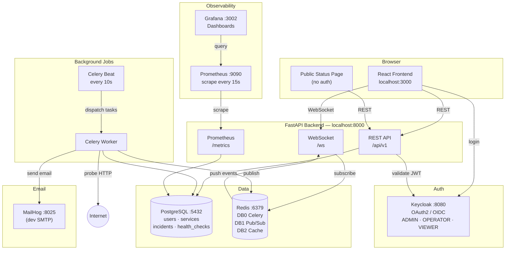
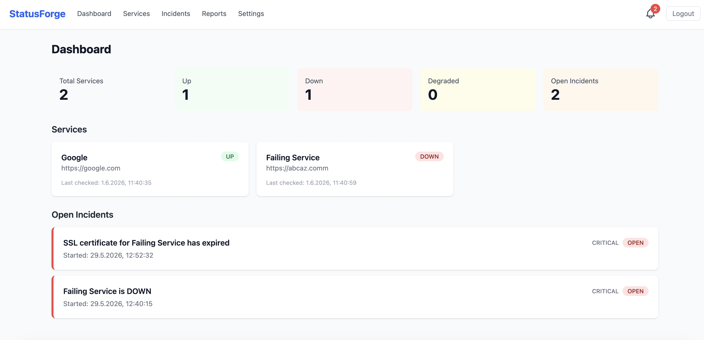
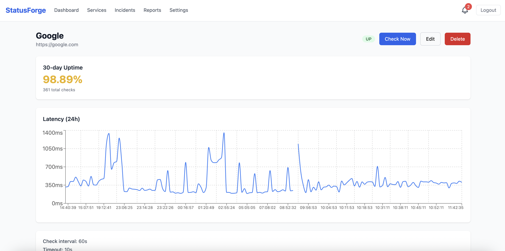
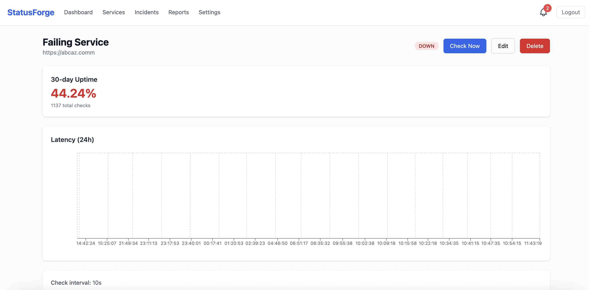
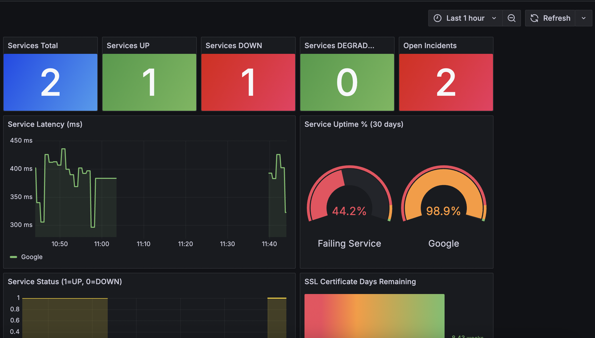
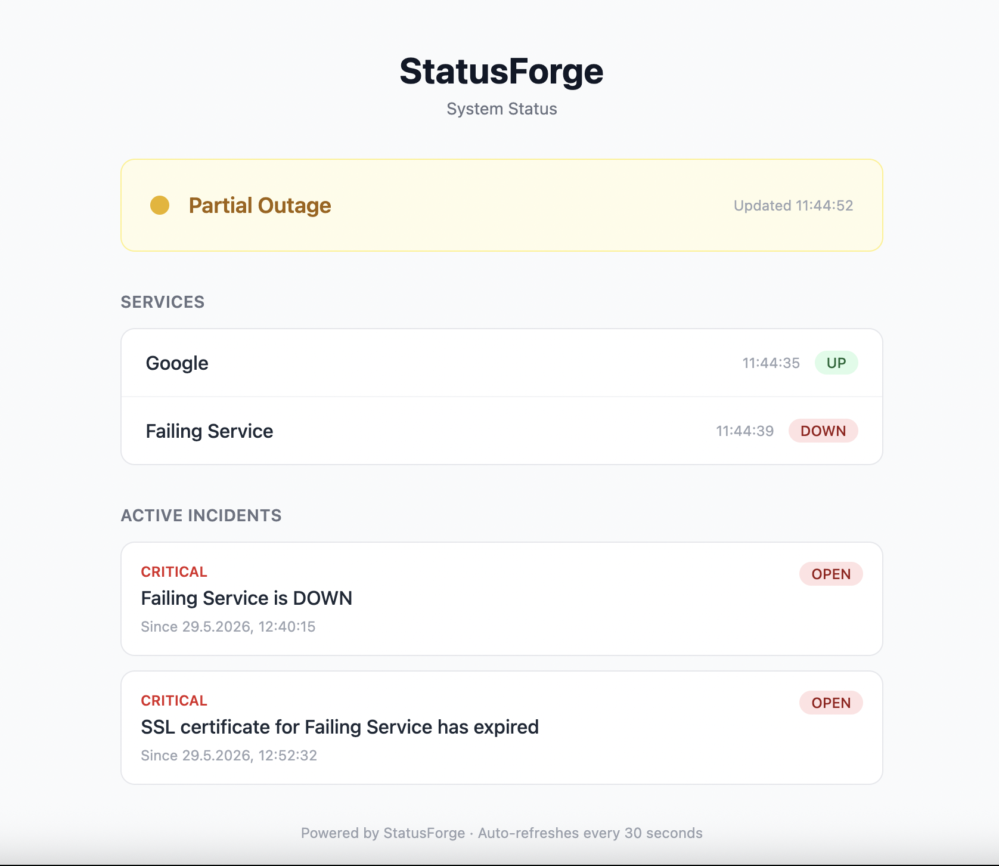
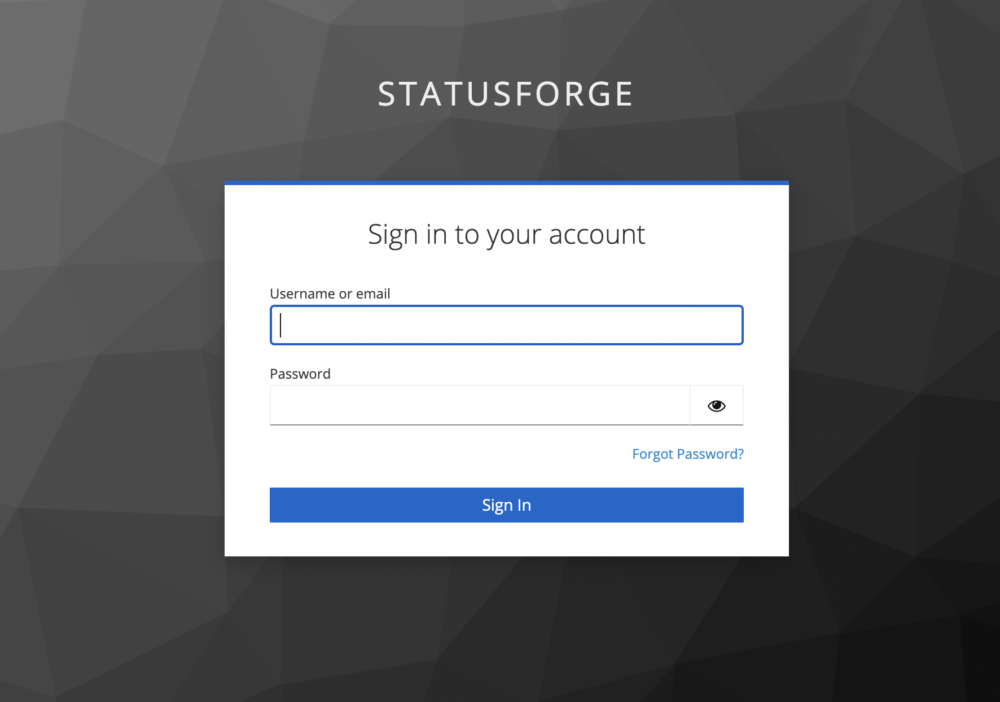

# StatusForge

A self-hosted monitoring and incident management platform. StatusForge continuously probes your services, detects failures automatically, creates incidents, and keeps your team informed in real time.

---

## Architecture



---

## Screenshots

### Dashboard



### Services



### Incident Detail



### Grafana Dashboard



### Public Status Page



### Keycloak Login



---

## Features

- **Automatic monitoring** — HTTP health checks every 10 seconds per service
- **Incident lifecycle** — Auto-created on failure, auto-resolved on recovery
- **Real-time updates** — WebSocket push to all connected browsers
- **Role-based access** — ADMIN / OPERATOR / VIEWER via Keycloak
- **In-app notifications** — Bell icon with unread badge, per-user
- **Email notifications** — Sent on incident open and resolve (MailHog in dev)
- **SLA reports** — Uptime %, average latency, downtime minutes per service
- **SSL monitoring** — Certificate expiry tracked and alerted
- **Public status page** — No login required, shareable with customers
- **Prometheus metrics** — Scraped every 15s, full Grafana dashboard included

---

## Tech Stack

| Layer | Technology |
|---|---|
| Frontend | React 18, TypeScript, Vite, Tailwind CSS, TanStack Query v5 |
| Backend | Python 3.12, FastAPI, SQLAlchemy 2.0 (async), Pydantic v2 |
| Auth | Keycloak 24, OAuth2 / OIDC, JWKS token validation |
| Database | PostgreSQL 16 |
| Cache / Queue | Redis 7 (Celery broker, WebSocket pub/sub, JWKS cache) |
| Background Jobs | Celery + Celery Beat |
| Observability | Prometheus, Grafana |
| Dev Email | MailHog |
| Infrastructure | Docker Compose |

---

## Getting Started

### Prerequisites

- Docker Desktop

### Setup

```bash
git clone <repo-url>
cd statusforge
cp .env.example .env
```

Edit `.env` and set secure values for all `change-me` fields.

```bash
docker compose up -d
```

Wait ~30 seconds for Keycloak to initialize, then open:

| Service | URL |
|---|---|
| App | http://localhost:3000 |
| Grafana | http://localhost:3002 |
| Prometheus | http://localhost:9090 |
| Keycloak Admin | http://localhost:8080/admin |
| MailHog | http://localhost:8025 |

### Default Credentials

| Service | Username | Password |
|---|---|---|
| App (Keycloak) | `admin` | set in `.env` → `KEYCLOAK_ADMIN_PASSWORD` |
| Grafana | `admin` | set in `.env` → `GRAFANA_ADMIN_PASSWORD` |
| Keycloak Admin | `admin` | set in `.env` → `KEYCLOAK_ADMIN_PASSWORD` |

---

## Running Tests

```bash
docker exec statusforge-backend-1 python -m pytest tests/ -v
```

Tests cover:
- Services CRUD + RBAC
- Incident lifecycle (create, acknowledge, resolve, comment)
- HTTP probe logic (UP / DOWN / DEGRADED / timeout)

---

## Role Permissions

| Action | ADMIN | OPERATOR | VIEWER |
|---|---|---|---|
| View dashboard / incidents / metrics | ✓ | ✓ | ✓ |
| Create / edit services | ✓ | ✓ | — |
| Acknowledge / resolve incidents | ✓ | ✓ | — |
| Delete services | ✓ | — | — |
| Manage users | ✓ | — | — |

---

## Project Structure

```
statusforge/
├── backend/
│   ├── app/
│   │   ├── auth/           # JWT validation, RBAC, Keycloak client
│   │   ├── services/       # Monitored service CRUD
│   │   ├── monitoring/     # Health check model, HTTP probe
│   │   ├── incidents/      # Incident model, lifecycle service
│   │   ├── notifications/  # In-app + email notifications
│   │   ├── metrics/        # Dashboard summary, latency series
│   │   ├── prometheus/     # /metrics endpoint
│   │   ├── reports/        # SLA report
│   │   ├── status/         # Public status page API
│   │   ├── tasks/          # Celery app, beat schedule, health_check task
│   │   └── core/           # config, database, redis
│   └── tests/
├── frontend/src/
│   ├── pages/              # Dashboard, Services, Incidents, Reports, Settings
│   └── components/         # StatusBadge, IncidentCard, NotificationBell, ...
├── grafana/                # Dashboard JSON + provisioning
├── prometheus/             # prometheus.yml
├── keycloak/               # realm-export.json
└── docker-compose.yml
```
